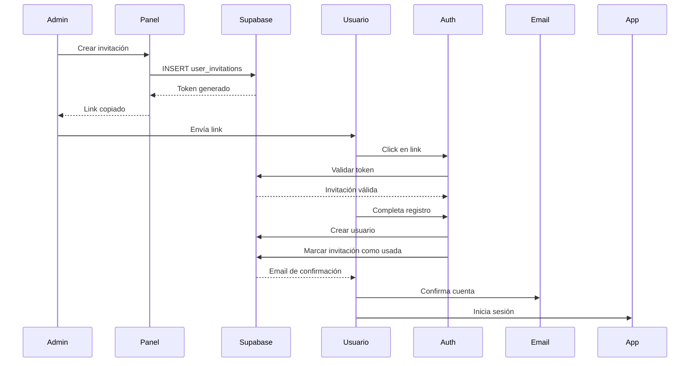

# Sistema de Invitaciones y Gestión de Usuarios

## 📋 Descripción

Sistema completo de invitaciones para registro de usuarios con gestión de roles y departamentos.

## 🎯 Características

### ✅ Sistema de Invitaciones
- **Invitaciones por email** con tokens únicos
- **Expiración configurable** (por defecto 48 horas)
- **Links de un solo uso** que se marcan como usados
- **Reenvío de invitaciones** con nuevo token
- **Cancelación de invitaciones** pendientes

### 👥 Gestión de Roles
- **Admin**: Acceso total + gestión de usuarios
- **Manager**: Gestión completa excepto eliminar recetas/ingredientes
- **Staff**: Crear/editar eventos, solo lectura en recetas
- **Viewer**: Solo lectura

### 🏢 Gestión de Departamentos
- Crear departamentos personalizados
- Asignar usuarios a departamentos
- Organizar equipos por áreas

## 🚀 Instalación

### 1. Aplicar Migración SQL

Ejecuta el archivo de migración en Supabase:

```bash
cd app.gula
supabase db push
```

O manualmente en el SQL Editor de Supabase:
```sql
-- Copiar y ejecutar el contenido de:
supabase/migrations/20240120_user_invitations.sql
```

### 2. Verificar Tablas Creadas

Deberías ver estas nuevas tablas:
- `user_invitations`
- `departments`
- `profiles` (con nueva columna `department_id`)

## 📖 Uso

### Para Administradores

#### 1. Acceder al Panel de Administración

- Inicia sesión como administrador
- Ve a `/admin` o haz clic en el botón "Admin" en el header

#### 2. Crear una Invitación

1. Click en "Nueva Invitación"
2. Ingresa el email del usuario
3. Selecciona el rol (Admin, Manager, Staff, Viewer)
4. (Opcional) Asigna un departamento
5. Click en "Crear Invitación"
6. **El link se copia automáticamente al portapapeles**

#### 3. Enviar la Invitación

Envía el link copiado al usuario por:
- Email
- WhatsApp
- Slack
- Cualquier medio de comunicación

#### 4. Gestionar Invitaciones

- **Copiar link**: Click en el icono de copiar
- **Reenviar**: Click en el icono de refrescar (genera nuevo token)
- **Cancelar**: Click en el icono de papelera

#### 5. Crear Departamentos

1. Ve a la pestaña "Departamentos"
2. Click en "Nuevo Departamento"
3. Ingresa nombre y descripción
4. Click en "Crear Departamento"

### Para Usuarios Invitados

#### 1. Recibir Invitación

Recibirás un link como:
```
https://tu-app.com/auth?invitation=1234567890-abcdef
```

#### 2. Completar Registro

1. Click en el link de invitación
2. Verás un mensaje de "Invitación válida"
3. El email estará pre-rellenado y bloqueado
4. Ingresa tu nombre completo
5. Crea una contraseña (mínimo 6 caracteres)
6. Click en "Crear Cuenta"
7. Confirma tu email (revisa tu bandeja de entrada)

#### 3. Iniciar Sesión

Una vez confirmado el email:
1. Ve a `/auth`
2. Ingresa tu email y contraseña
3. Click en "Iniciar Sesión"

## 🔐 Seguridad

### Características de Seguridad

✅ **Tokens únicos** generados con timestamp + random
✅ **Expiración automática** después de 48 horas
✅ **Un solo uso** - se marca como usado al registrarse
✅ **RLS (Row Level Security)** en Supabase
✅ **Solo admins** pueden crear invitaciones
✅ **Validación en backend** antes de crear cuenta

### Políticas RLS

```sql
-- Solo admins pueden gestionar invitaciones
CREATE POLICY "Admins can manage invitations" ON user_invitations
  FOR ALL
  USING (
    EXISTS (
      SELECT 1 FROM profiles 
      WHERE profiles.id = auth.uid() 
      AND profiles.role = 'admin'
    )
  );

-- Cualquiera puede validar su invitación por token
CREATE POLICY "Anyone can view invitation by token" ON user_invitations
  FOR SELECT
  USING (true);
```

## 🛠️ API

### InvitationService

```typescript
// Crear invitación
const invitation = await InvitationService.createInvitation({
  email: 'usuario@ejemplo.com',
  role: 'staff',
  department_id: 'uuid-departamento', // opcional
  expires_in_hours: 48 // opcional, default 48
});

// Validar token
const validation = await InvitationService.validateToken(token);
if (validation.valid) {
  console.log('Invitación válida:', validation.invitation);
}

// Marcar como usada
await InvitationService.markAsUsed(token);

// Obtener pendientes
const pending = await InvitationService.getPendingInvitations();

// Cancelar
await InvitationService.cancelInvitation(invitationId);

// Reenviar
const newInvitation = await InvitationService.resendInvitation(invitationId);

// Generar link
const link = InvitationService.getInvitationLink(token);
```

### DepartmentService

```typescript
// Obtener todos
const departments = await DepartmentService.getAll();

// Crear
const dept = await DepartmentService.create('Cocina', 'Equipo de cocina');

// Actualizar
await DepartmentService.update(id, 'Nuevo Nombre', 'Nueva descripción');

// Eliminar
await DepartmentService.delete(id);
```

## 📊 Estructura de Datos

### user_invitations

```typescript
{
  id: string;
  email: string;
  role: 'admin' | 'manager' | 'staff' | 'viewer';
  department?: string;
  token: string;
  invited_by?: string;
  expires_at: string;
  used_at?: string;
  created_at: string;
  updated_at: string;
}
```

### departments

```typescript
{
  id: string;
  name: string;
  description?: string;
  created_at: string;
  updated_at: string;
}
```

## 🔄 Flujo Completo



## ⚠️ Notas Importantes

1. **Primer Admin**: El primer usuario debe ser creado manualmente en Supabase y asignado rol 'admin'
2. **Limpieza**: Las invitaciones expiradas se pueden limpiar con:
   ```sql
   SELECT clean_expired_invitations();
   ```
3. **Emails**: Configura SMTP en Supabase para envío automático de emails
4. **Personalización**: Puedes cambiar el tiempo de expiración en `createInvitation()`

## 🎨 Personalización

### Cambiar tiempo de expiración

```typescript
const invitation = await InvitationService.createInvitation({
  email: 'usuario@ejemplo.com',
  role: 'staff',
  expires_in_hours: 72 // 3 días en lugar de 48 horas
});
```

### Agregar campos personalizados

Modifica la migración SQL para agregar campos adicionales a `user_invitations`:

```sql
ALTER TABLE user_invitations ADD COLUMN custom_field TEXT;
```

## 📞 Soporte

Para problemas o preguntas:
1. Revisa los logs en Supabase
2. Verifica las políticas RLS
3. Comprueba que el usuario admin existe
4. Revisa la consola del navegador para errores

## 🚀 Próximas Mejoras

- [ ] Envío automático de emails de invitación
- [ ] Plantillas de email personalizables
- [ ] Recordatorios de invitaciones pendientes
- [ ] Estadísticas de invitaciones
- [ ] Límite de invitaciones por admin
- [ ] Invitaciones masivas (CSV)
